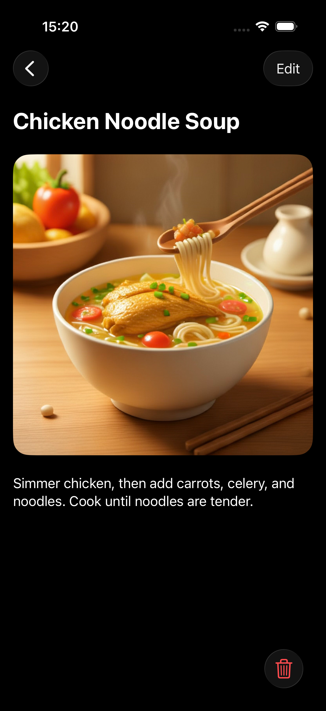
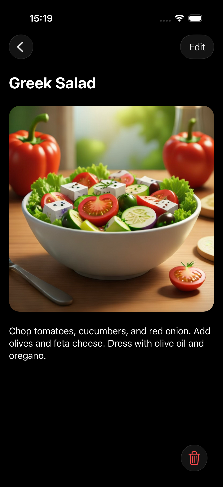

# 🥘 RecipeGrid  
*A clean, modern recipe manager built with SwiftUI*

**RecipeGrid** is a personal iOS app designed to help users collect, organize, and manage their favorite recipes.

> This project was created as a learning exercise to deepen my understanding of modern SwiftUI patterns, data flow, and user experience design.

---

## ✨ Features

- **Add & edit recipes**
- **Pick photos** from library using `PhotosPicker` (iOS 16+) and save them locally  
- **Local persistence**: recipe data in `UserDefaults` (`Codable`), images in app cache via `FileManager`  
- **Filter** by category, **search** by title/category, and **sort** alphabetically  
- **Modern UI**: adaptive grid (`LazyVGrid`), liquid glass styling, and sheet-based forms

---

## 🛠️ Tech Stack

| Layer | Technology |
|------|------------|
| **UI Framework** | SwiftUI (iOS 16+) |
| **State Management** | `@Observable` (Swift 5.9), `@Bindable` |
| **Data Storage** | `UserDefaults` (for structured data), `FileManager` (for images) |
| **Image Handling** | `PhotosPicker`, `UIImage`, PNG encoding |
| **Architecture** | MVVM-inspired (View ↔ ViewModel ↔ Local Storage) |
| **Utilities** | Custom file manager, reusable components (`CategoryPicker`, `InputTitle`, etc.) |

---

## 📱 Screenshots

<div align="center">
  
  
  
  <br>
  <em>From left to right: Recipe grid, detail view 1 and 2</em>
</div>

---

## 🚀 How to Run

1. Clone the repository  
   ```bash
   git clone https://github.com/Lyasan-byte/RecipeGrid.git
